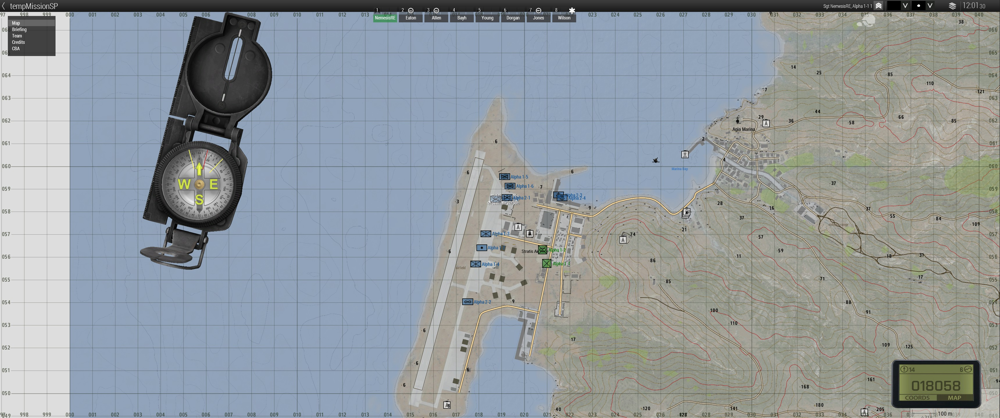
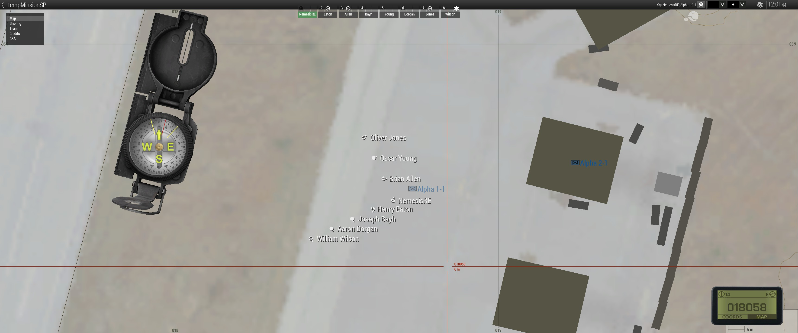
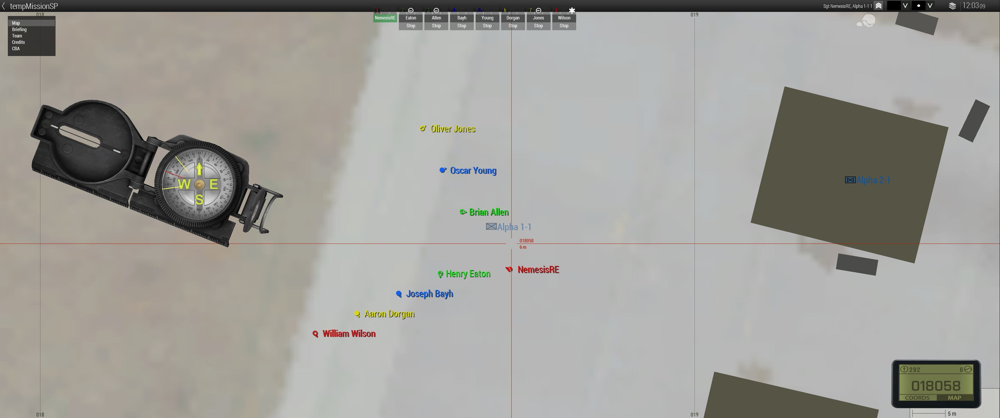
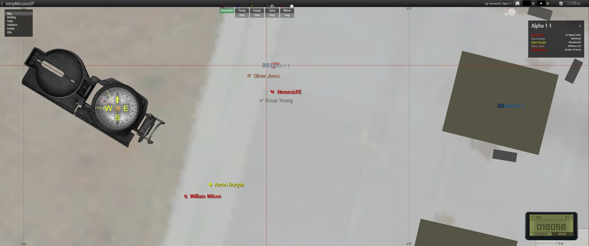

<h1 align="center">[qip] BFT</h1>

    
    
    
    
    

    <strong>Requires the latest version of <a href="https://github.com/CBATeam/CBA_A3/releases">CBA A3</a></strong>

**[qip] BFT** is born out of the idea to rewrite a BFT script into a Mod and ending up writing it almost completely from scratch.
Thankfully there is an open and helping community which made that possible.

BFT (Blufor Tracking or Blue Force Tracking) shows friendly units on a map. In this case this would be the map, GPS or any other device which can display local markers. It's up to you what you want to track, almost everything is configurable.

## Features

- completely configurable with CBA settings
- group tracking for own faction, friendly factions and civilians
- dynamic diplomacy updates show units based on the friend state
- group details on group icon hover (on click is planned)
- unit tracking for own Group
- unit life state for several medical mods/scripts and vanilla
- unit assigned team color

## Dependencies
- <a href="https://github.com/CBATeam/CBA_A3/releases">CBA A3</a>
- <a href="https://github.com/acemod/ACE3/releases">ACE3 (optional)</a>

## Screenshot
</img> </img>
</img> </img>

And for all of you developers out there PR's are welcome.

 qipBFT is licensed under a <a rel="license" href="http://creativecommons.org/licenses/by-nc-sa/4.0/">Creative Commons Attribution-NonCommercial-ShareAlike 4.0 International License</a>.
